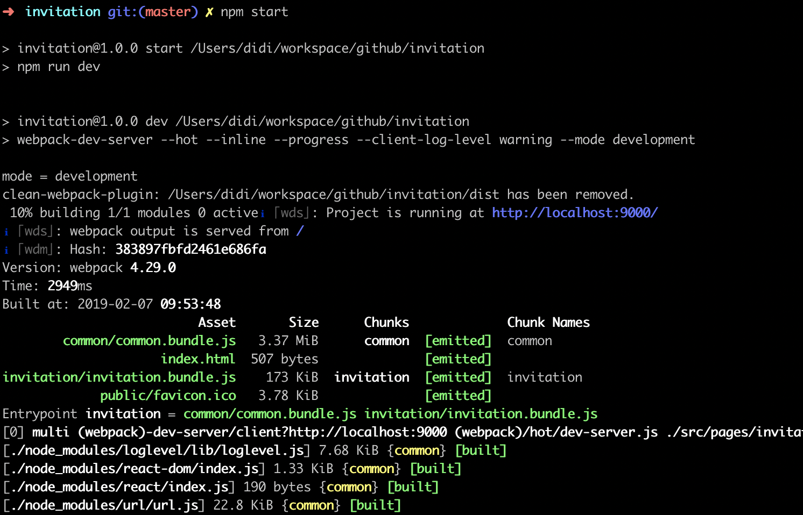
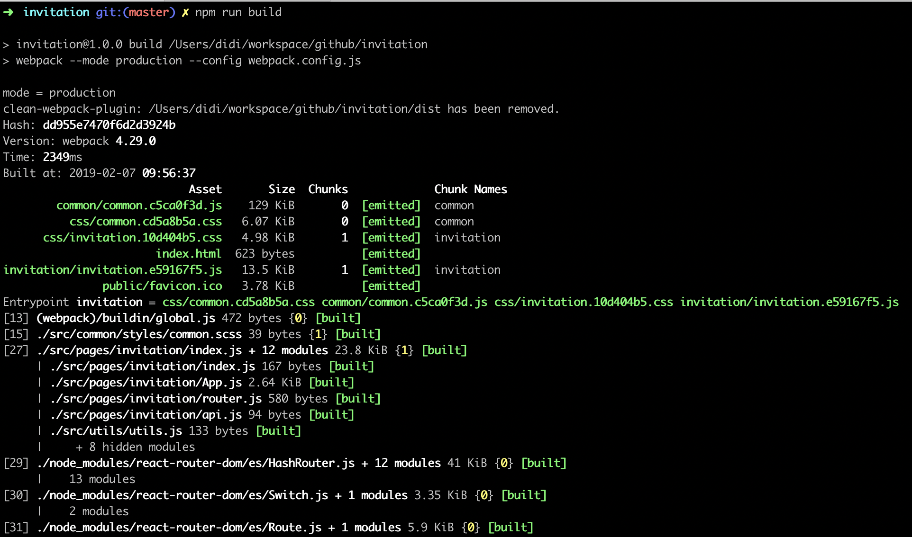

# Invitition

This is an invitation for Broccoli & Co.


## development

```bash
$ npm i
$ npm start
$ open http://127.0.0.1:9000/

# run test spec
$ npm test
```



## build

```bash
$ npm run  build
```



the dist directory structure is:

```
├── common
│   └── common.c5ca0f3d.js
├── css
│   ├── common.cd5a8b5a.css
│   └── invitation.10d404b5.css
├── index.html
├── invitation
│   └── invitation.e59167f5.js
└── public
    └── favicon.ico
```
